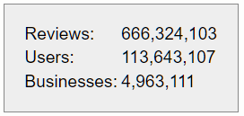
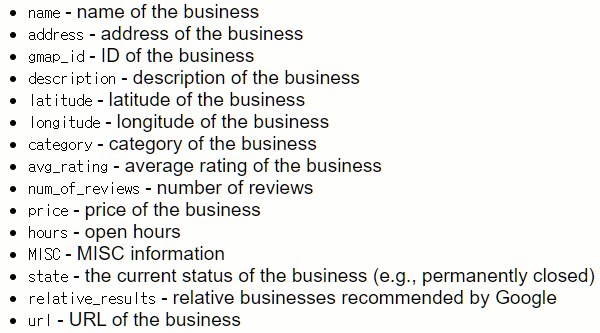
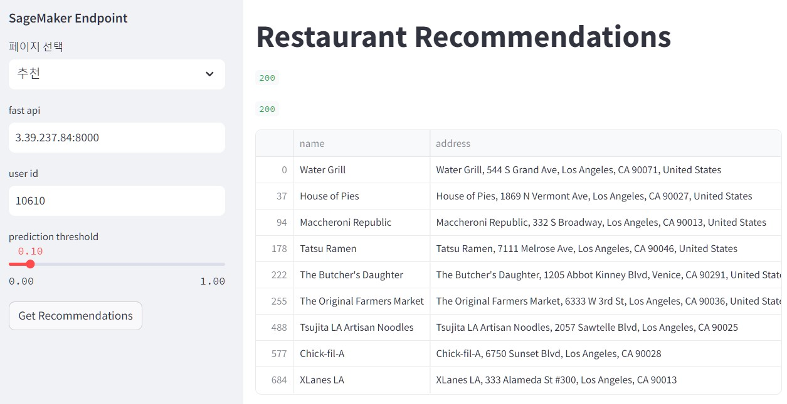
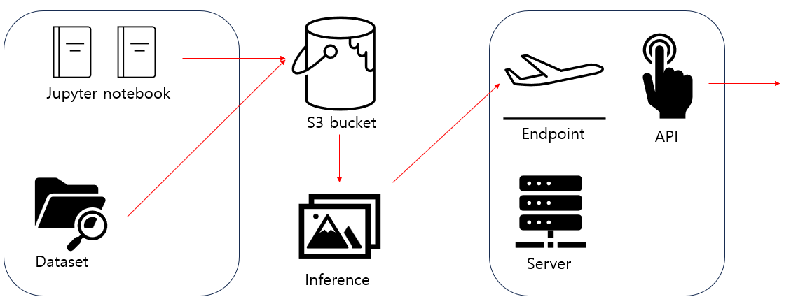

# MachineLearning

## Business Objective
Our recommend system is recommend California's restaurant by analyzing user's rating about restaurants, using  user-based CF & content-based CF, clusteing method.

## Dataset (in California)
### https://datarepo.eng.ucsd.edu/mcauley_group/gdrive/googlelocal/

## Data Description
This Dataset contains review information on Google map (ratings, text, images, etc.), business metadata (address, geographical info, descriptions, category information, price, open hours, and MISC info), and links (relative businesses) up to Sep 2021 in the United States.



## Data exploration(format)
### Review


### Metadata



## Data Preprocessing
- Delete unnecessary features and duplicates data
- Implement rating matrix by user's rating

## Modeling

### Train a Neural Collaborative Filtering (NCF) model using TensorFlow on Amazon SageMaker

```
# inspect the training script using `pygmentize` magic
!pygmentize 'ncf.py''

# specify training instance type and model hyperparameters
# note that for the demo purpose, the number of epoch is set to 1

num_of_instance = 1                 # number of instance to use for training
instance_type = 'ml.m5.large'     # type of instance to use for training

training_script = 'ncf.py'

training_parameters = {
    'epochs': 1,
    'batch_size': 256, 
    'n_user': n_user, 
    'n_item': n_item
}

# training framework specs
tensorflow_version = '2.1.0'
python_version = 'py3'
distributed_training_spec = {'parameter_server': {'enabled': True}}

# initiate the training job using Tensorflow estimator
ncf_estimator = TensorFlow(
    entry_point=training_script,
    role=role,
    instance_count=num_of_instance,
    instance_type=instance_type,
    framework_version=tensorflow_version,
    py_version=python_version,
    distribution=distributed_training_spec,
    hyperparameters=training_parameters
)

# kick off the training job
ncf_estimator.fit(training_data_uri)
```
### Create Endpoint
```
endpoint_name = 'ep-rest-rec-002'
model_name = 'rest-recommend-model-sg02'

predictor = ncf_estimator.deploy(
    initial_instance_count=1, 
    instance_type="ml.m5.large", 
    endpoint_name=endpoint_name,
    model_name=model_name,
)
```

### Delete Endpoint
```
predictor.delete_endpoint(delete_endpoint_config=True)
```

# training framework specs
tensorflow_version = '2.1.0'
python_version = 'py3'
distributed_training_spec = {'parameter_server': {'enabled': True}}

## Model Evaluation & analyze



## System architecture(AWS)

